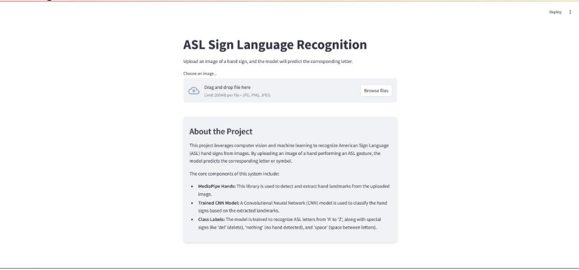
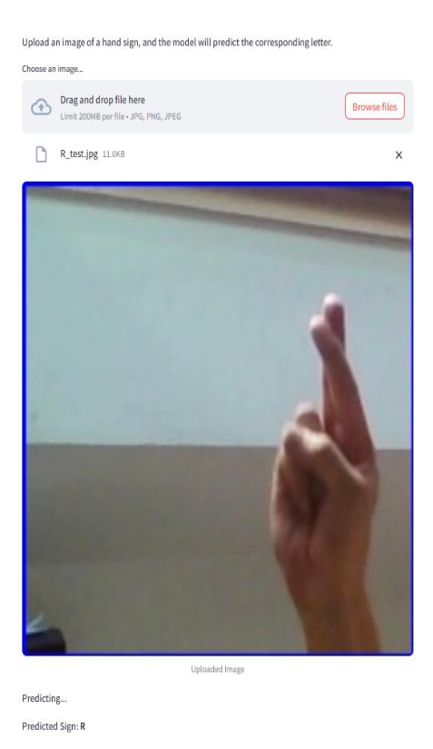

# 🧠 ASL Sign Language Recognition System

A deep learning-based ASL Sign Language Recognition System that uses a CNN model to identify hand signs from images. Includes a simple UI for real-time predictions and supports image uploads for classification.

---

## 📑 Table of Contents

- [About the Project](#-about-the-project)
- [Tech Stack](#-tech-stack)
- [Features](#-features)
- [Repo Structure](#-repo-structure)
- [Kaggle Database](#-kaggle-database)
- [Setup Instructions](#-setup-instructions)
- [How It Works](#-how-it-works)
- [Screenshots](#-screenshots)
- [Future Enhancements](#-future-enhancements)
- [Contact](#-contact)

---

## 📘 About the Project

This project is designed to recognize American Sign Language (ASL) alphabets using a trained Convolutional Neural Network (CNN). Users can upload hand sign images via an interface and get real-time predictions.

---

## 🧰 Tech Stack

- Python
- TensorFlow / Keras
- OpenCV
- Streamlit
- scikit-learn / joblib

---

## ✨ Features

- ASL hand sign classification (A–Z)
- Real-time prediction via web interface
- CNN model trained on Kaggle dataset
- Lightweight and easy to run locally

---

## 📂 Repo Structure

.<br>
├── app.py # Streamlit UI<br>
├── asl.py # Prediction logic<br>
├── cnn_asl.joblib # Trained CNN model<br>
├── predict.png # Prediction image<br>
├── ui.png # Streamlit UI<br>
├── result.png # Model Training Results<br>
├── README.md # Documentation<br>


---

## 📊 Kaggle Database

This project uses the publicly available [ASL Alphabet Dataset on Kaggle](https://www.kaggle.com/datasets/grassknoted/asl-alphabet).

Expected structure after download:

data/<br>
├── train/<br>
└── test/<br>


---

## ⚙️ Setup Instructions

1. **Clone the repository:**

   ```bash
   git clone https://github.com/your-username/asl-sign-language-recognition.git
   cd asl-sign-language-recognition
   ```

2. **Install dependencies:**

  ```bash
  pip install streamlit opencv-python joblib
  ```

3. **Run the app:**

  ```bash
     streamlit run app.py
  ```


## 🧠 How It Works

    The model was trained on ASL hand sign images (A-Z) using a CNN architecture.

    The model is saved as cnn_asl.joblib.

    Uploaded images are processed and classified using the trained model.

    Streamlit displays the result in a user-friendly format.

## 🖼️ Screenshots

Training Results


Streamlit UI


Prediction on test image


## 🚧 Future Enhancements

    Add webcam support for live sign detection

    Expand model to include dynamic signs and gestures

    Improve model accuracy with data augmentation

    Host the app on the web using Streamlit Cloud or Hugging Face Spaces

## 📬 Contact

Anij Mehta<br>
🔗 [GitHub](https://github.com/anij-mehta)<br>
🔗 [LinkedIn](https://www.linkedin.com/in/anij-mehta)
